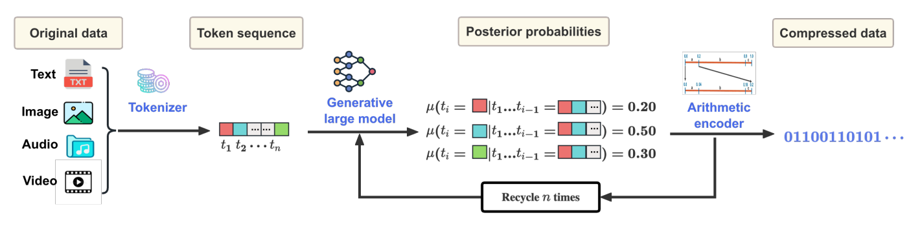

# AI.zip 🗜️📁

This repository investigates the fascinating relationship between AI and data compression through both theoretical exploration and practical implementation.

The core insight is that **compression and intelligence are deeply connected** - to compress data effectively, you need to understand its patterns and structure.

> *"**Why unify information theory and machine learning?** Because they are two sides of the same coin."*
>
> ― David MacKay, [Information Theory, Inference and Learning Algorithms](https://www.cambridge.org/gb/universitypress/subjects/computer-science/pattern-recognition-and-machine-learning/information-theory-inference-and-learning-algorithms)

> *"**Prediction is intuitively related to understanding.** If you understand a sequence, then you can predict it. If you understand a language, then you could predict what word might appear next in a paragraph in that language. If you understand an image, then you could predict what might lie under portions of the image that are covered up. Alternatively, random data has no meaning and is not predictable. This intuition suggests that prediction or compression could be used to test or measure understanding."*
> 
> ― Matt Mahoney, [Data Compression Explained](https://mattmahoney.net/dc/dce.html)


## Table of Contents 📚

- [The Big Idea 💡](#the-big-idea-💡)
- [Key Insights & Research Themes ☀️](#key-insights--research-themes-☀️)
  - [Core Concepts](#core-concepts)
  - [Research Highlights](#research-highlights)
- [Examples 🛠️](#examples-🛠️)
  - [Gzip Text Classifier 🧪](#gzip-text-classifier-🧪)
  - [LLM-Based Lossless Compression 🤖](#llm-based-lossless-compression-🤖)
    - [The Core Algorithm](#the-core-algorithm)
    - [Mathematical Foundation](#mathematical-foundation)
    - [Technical Implementation](#technical-implementation)
- [References 📖](#references-📖)
  - [Articles 📑](#articles-📑)
  - [Books 📚](#books-📚)
  - [Blogs/News ✍️](#blogsnews-️✍️)
  - [Code & Tools 💻](#code--tools-💻)
  - [Learn More 🚀](#learn-more-🚀)
- [Fun Extras 🎨](#fun-extras-🎨)
- [Contributing 🤝](#contributing-🤝)
- [License 📜](#license-📜)

## The Big Idea 💡

**Compressors $\rightleftarrows$ Predictors:** compression, prediction and inference are intimately related. If you can compress data well, you must have a good model for it. Most data compression algorithms are really just models of our data with a coder head. The reverse also holds true: if we have a good model of our data, we can compress it (our brains do it all the time). This equivalence relation between compression and prediction means that we can pretty much convert any compressor into a predictor, and vice versa. As articulated in the [Hutter Prize challenge](http://prize.hutter1.net/hfaq.htm#compai) FAQ:

> *"One can prove that the better you can compress, the better you can predict; and being able to predict [the environment] well is key for being able to act well."*

**Understanding=Compression:** the obvious corollary is that in order to fully understand data, we must find its most *compact* representation. This connects ancient philosophical arguments with cutting-edge research in AI and data compression algorithms:

- **[Aristotle's Posterior Analytics](https://www.logicmuseum.com/authors/aristotle/posterioranalytics/posterioranalytics.htm) (4th century BC):** a better explanation uses fewer assumptions

- **[Occam's Razor](https://math.ucr.edu/home/baez/physics/General/occam.html) (14th century):** the simplest, most elegant explanation is usually the correct one

- **[Solomonoff's General Theory of Inductive Inference](https://raysolomonoff.com/) (1964):** if an algorithm creates the Universe, its observations can be predicted by its smallest executable archive

- **[Hutter's Universal Artificial Intelligence](https://hutter1.net/ai/) (2005):** the optimal agent compresses its experience into the shortest program that predicts future observations


**LLMs as Compressors:** modern Large Language Models (LLMs) reveal a profound connection between language understanding and data compression. They demonstrate how intelligence naturally leads to efficient information encoding through two complementary approaches.

**Lossy Compression > Training:** during training, LLMs perform massive [*lossy* compression on Internet-scale text data](https://www.youtube.com/watch?v=zjkBMFhNj_g&t=257s). Trained on trillions of tokens, the model's billions of parameters become a compact representation of human knowledge and linguistic patterns.


As Ted Chiang elegantly explains, this process creates a "blurry but useful" compression of human knowledge:

> *"**Think of ChatGPT as a blurry JPEG of all the text on the Web.** It retains much of the information on the Web, in the same way that a JPEG retains much of the information of a higher-resolution image, but, if you're looking for an exact sequence of bits, you won't find it; all you will ever get is an approximation. But, because the approximation is presented in the form of grammatical text, which ChatGPT excels at creating, it's usually acceptable."*
>
> ― Ted Chiang, [ChatGPT is a blurry JPEG of the Web](https://www.newyorker.com/tech/annals-of-technology/chatgpt-is-a-blurry-jpeg-of-the-web)

**Lossless Compression > Prediction:** the trained model can then be used for *lossless* compression by leveraging its predictive capabilities. The LLM generates probability distributions over next tokens, which drives entropy-based algorithms like arithmetic coding to achieve optimal compression ratios (Li *et al.*, 2025):



**Universal Compression:** remarkably, LLMs trained primarily on text data can actually function as *general-purpose* lossless compressors. Recent research shows they can outperform traditional algorithms even on non-textual data like images and audio, suggesting that language modeling captures fundamental patterns of information structure (Déletang *et al.*, 2023).

**The AGI Connection:** If intelligence emerges from finding minimal descriptions of our observations, then the path to AGI runs directly through compression. Better compression algorithms don't just save storage - they represent deeper understanding of the world.

## Key Insights & Research Themes 💡

### Core Concepts

- **Intelligence as Compression:** the idea that understanding data requires finding efficient representations
- **Language Models as Compressors:** modern LLMs achieve impressive compression by learning linguistic patterns  
- **Information Theory Foundations:** connecting Kolmogorov complexity, minimum description length (MDL), and machine learning
- **Practical Applications:** how compression techniques can improve ML algorithms and vice versa

### Research Highlights

**🏆 Breakthrough Papers**

- *Language Modeling is Compression* (Delétang *et al.*, 2023) - shows LLMs can outperform traditional compressors
- *"Low-Resource" Text Classification* (Jiang *et al.*, 2023) - The controversial "gzip beats BERT" paper
- *Lossless data compression by large models* (Li *et al.*, 2025) - latest advances in neural compression

**🔥 Hot Topics**

- Neural data compression techniques
- Compression-based few-shot learning
- Information-theoretic analysis of deep learning
- Scaling laws through compression lens
- Compression as general intelligence metric

## Examples 🛠️

### Gzip Text Classifier 🧪

#### Overview

`gzip_classifier.py` demonstrates how simple compression algorithms can be surprisingly effective for text classification tasks.

Based on the methodology from Jiang *et al.* (2023), this implementation uses:

- **Normalized Compression Distance (NCD)** to measure text similarity
- **k-Nearest Neighbors (k-NN)** for classification
- **Parallel processing** for performance optimization
- **Adaptive strategies** that scale from small to large datasets

#### Quick Start

```bash
uv run gzip_classifier.py
```

The classifier automatically downloads the AG News dataset and performs text classification via k-nearest neighbors (k-NN) using only gzip compression - no neural networks required!

### LLM-Based Lossless Compression 🤖

#### Overview

`llama_zip.py` demonstrates how large language models can achieve superior lossless compression by leveraging their deep understanding of linguistic patterns and structures.

> 🙌 Adapted from [AlexBuz/llama-zip](https://github.com/AlexBuz/llama-zip), a lossless compression utility that leverages a user-provided LLM as the probabilistic model for an arithmetic coder

#### Quick Start

```bash
# Compress text using a local LLaMA model
uv run llama_zip.py model.gguf -c "Hello, world!" -f base64

# Decompress the output
uv run llama_zip.py model.gguf -d <base64_output> -f base64

# Interactive mode for experimentation
uv run llama_zip.py model.gguf -i
```

The implementation showcases how the marriage of modern language models with classical information theory yields state-of-the-art lossless compression, especially for text-heavy data.

#### The Core Algorithm

The implementation combines **language modeling** with **arithmetic coding** to achieve optimal compression:

1. **Probabilistic Modeling:** the LLM predicts probability distributions $P(x_t | x_{<t})$ for each token $x_t$ given context $x_{<t}$
2. **Arithmetic Encoding:** these probabilities drive an arithmetic coder that assigns optimal bit lengths to tokens
3. **Lossless Reconstruction:** the same model and probabilities enable perfect decompression

#### Mathematical Foundation

**Information-Theoretic Optimality:** given a probability distribution $P(X)$, the optimal code length for symbol $x$ is $-\log_2 P(x)$ bits (Shannon's theorem). The expected code length approaches the entropy:

$$H(X) = -\sum_{x} P(x) \log_2 P(x)$$

**Arithmetic Coding Mechanics:** unlike prefix codes (e.g., Huffman), arithmetic coding represents entire sequences as single fractional numbers in $[0,1)$. The algorithm maintains an interval $[\text{low}, \text{high})$ that narrows with each symbol.

**Interval Subdivision:** for a symbol $s_i$ with probability $p_i$ and cumulative probability $F(s_i) = \sum_{j<i} p_j$, the update rule works like this

$$\text{range} = \text{high} - \text{low}$$
$$\text{low} = \text{low} + \text{range} \cdot F(s_i)$$
$$\text{high} = \text{low} + \text{range} \cdot F(s_{i+1})$$

**Encoding Process:** given sequence $x_1, x_2, \ldots, x_n$, the final interval uniquely identifies the sequence. Any number within this interval can decode back to the original sequence.

**Cumulative Distribution:** the implementation uses integer arithmetic with scaled frequencies. For vocabulary size $V$ and scale factor $S$:

$$\text{freq}_i = \max(1, \text{round}(S \cdot p_i))$$
$$\text{cumfreq}_i = \sum_{j=0}^{i} \text{freq}_j$$

**Precision and Renormalization:** to prevent numerical underflow, the coder performs renormalization when intervals become too narrow:

- **MSB identical:** when $\text{low}$ and $\text{high}$ share the same most significant bit, output that bit and left-shift both bounds
- **Underflow handling:** When $\text{low} \geq 2^{k-1}$ and $\text{high} < 2^k$ for middle range, apply underflow transformation

**Theoretical Compression Bound:** for a sequence $X = x_1, \ldots, x_n$ with model probabilities $Q(x_i | x_{<i})$:

$$\text{Code Length} = -\sum_{i=1}^{n} \log_2 Q(x_{i} | x_{\lt i}) + O(1)$$

This approaches the cross-entropy $H_Q(X)$ between the true distribution and model, making compression quality directly tied to model accuracy.

**LLM Integration:** the key insight is using the LLM's next-token predictions $P(x_t | x_{<t})$ as the probability model for arithmetic coding. Better language models → better probability estimates → better compression.

#### Technical Implementation

**Byte-to-Unicode Mapping:** binary data is encoded using Unicode [Private Use Area](https://en.wikipedia.org/wiki/Private_Use_Areas) (PUA) characters to make it processable by text-based LLMs:

```python
# Map invalid UTF-8 bytes to PUA range [0xE000, 0xE0FF]
def bytes_to_utf8(data: bytes):
    for chunk in Utf8Chunks(data):
        for byte in chunk.invalid:
            output.extend(chr(PUA_START + byte).encode("utf-8"))
```

**Context Window Management:** uses sliding window approach with configurable overlap to handle sequences longer than the model's context limit:

```python
# Maintain context coherence across windows
start_idx = max(0, next_token_idx - window_overlap)
```

**Probability Extraction:** converts model logits to cumulative distribution functions for arithmetic coding:

```python
def compute_cdf(self, logits):
    logprobs = self.model.logits_to_logprobs(logits)
    probs = np.exp(logprobs).astype(np.float64)
    freqs = np.maximum(1, np.round(FREQ_SCALE_FACTOR * probs))
    return np.cumsum(freqs)
```

**CDF to Arithmetic Coding Connection:** the CDF is essential for arithmetic coding because it defines the interval boundaries for each symbol. For a token with index `i`:

- **Lower bound:** `cumfreqs[i-1]` (or 0 for the first token)
- **Upper bound:** `cumfreqs[i]`
- **Total range:** `cumfreqs[-1]` (sum of all frequencies)

During encoding, when the arithmetic coder encounters token `i`, it:

```python
# Get the symbol's interval from the CDF
range = self.high - self.low + 1
total = int(cum_freqs[-1])
symlow = int(cum_freqs[symbol - 1]) if symbol > 0 else 0
symhigh = int(cum_freqs[symbol])

# Update interval bounds proportionally
self.low = self.low + symlow * range // total
self.high = self.low + symhigh * range // total - 1
```

The CDF essentially partitions the unit interval $[0,1)$ into segments proportional to each token's probability. Tokens with higher probabilities (from the LLM) get larger segments, resulting in shorter encoded bit sequences - this is how the model's linguistic knowledge directly translates to compression efficiency.

**Practical Advantages:**

- **Context-Aware:** unlike traditional compressors, LLMs understand semantic context
- **Adaptive:** model predictions adapt to document style and content  
- **Domain-Specific:** fine-tuned models excel on specialized text types
- **Multilingual:** modern LLMs handle diverse languages and scripts

**Trade-offs:**

- **Computational Cost:** requires GPU acceleration for practical speeds
- **Model Size:** large models needed for best compression ratios (TBC)
- **Deterministic:** same model and settings required for decompression

## References 📖

### Articles 📑

- (Bennet *et al.*, 1998) [Information Distance](https://cs.uwaterloo.ca/~mli/informationdistance.pdf)
- (Blier & Ollivier, 2018) [The Description Length of Deep Learning Models](https://arxiv.org/abs/1802.07044)
- (Buttrick, 2024) [Studying large language models as compression algorithms for human culture](https://www.cell.com/trends/cognitive-sciences/abstract/S1364-6613(24)00001-9)
- (Chen *et al.*, 2024a) [Information Compression in the AI Era: Recent Advances and Future Challenges](https://arxiv.org/abs/2406.10036)
- (Chen *et al.*, 2024b) [Large Language Models for Lossless Image Compression: Next-Pixel Prediction in Language Space is All You Need](https://arxiv.org/abs/2411.12448)
- (David, Moran & Yehudayoff, 2016) [On statistical learning via the lens of compression](https://arxiv.org/abs/1610.03592)
- (Delétang *et al.*, 2023) [Language Modeling is Compression](https://arxiv.org/abs/2309.10668)
- (Dubois *et al.*, 2021) [Lossy Compression for Lossless Prediction](https://arxiv.org/abs/2106.10800)
- (Franceschelli, Cevenini & Musolesi, 2024) [Training Foundation Models as Data Compression: On Information, Model Weights and Copyright Law](https://arxiv.org/abs/2407.13493v3)
- (Frank, Chui & Witten, 2000) [Text categorization using compression models](https://ieeexplore.ieee.org/document/838202/)
- (Goldblum *et al.*, 2023) [The No Free Lunch Theorem, Kolmogorov Complexity, and the Role of Inductive Biases in Machine Learning](https://arxiv.org/abs/2304.05366)
- (Guo *et al.*, 2024) [Ranking LLMs by compression](https://arxiv.org/abs/2406.14171)
- (Grünwald, 2004) [A tutorial introduction to the minimum description length principle](https://arxiv.org/abs/math/0406077)
- (Heurtel-Depeiges *et al.*, 2024) [Compression via Pre-trained Transformers: A Study on Byte-Level Multimodal Data](https://arxiv.org/abs/2410.05078)
- (Hinton & Camp, 1993) [Keeping the neural networks simple by minimizing the description length of the weights](https://dl.acm.org/doi/10.1145/168304.168306)
- (Huang *et al.*, 2024) [Compression Represents Intelligence Linearly](https://arxiv.org/abs/2404.09937)
- (Jaynes, 1957) [Information Theory and Statistical Mechanics](https://bayes.wustl.edu/etj/articles/theory.1.pdf)
- (Jiang, 1999) [Image compression with neural networks – A survey](https://www.sciencedirect.com/science/article/abs/pii/S0923596598000411)
- (Jiang *et al.*, 2023) ["Low-Resource" Text Classification: A Parameter-Free Classification Method with Compressors](https://aclanthology.org/2023.findings-acl.426)
  - **Preprint** // [Less is More: Parameter-Free Text Classification with Gzip](https://arxiv.org/abs/2212.09410)
  - **Note** // The original paper had several issues related to [accuracy calculation](https://github.com/bazingagin/npc_gzip/issues/3) and [train-test leakage](https://github.com/bazingagin/npc_gzip/issues/13)
- (Lan *et al.*, 2022) [Minimum Description Length Recurrent Neural Networks](https://direct.mit.edu/tacl/article/doi/10.1162/tacl_a_00489/112499/Minimum-Description-Length-Recurrent-Neural)
- (Lester *et al.*, 2024) [Training LLMs over Neurally Compressed Text](https://arxiv.org/abs/2404.03626v1)
- (Li *et al.*, 2025) [Lossless data compression by large models](https://www.nature.com/articles/s42256-025-01033-7)
  - **Preprint:** [Understanding is Compression](https://arxiv.org/abs/2407.07723)
- (Maguire *et al.*, 2015) [Compressionism: A Theory of Mind Based on Data Compression](https://norma.ncirl.ie/2114/)
- (Mao, Pirk & Xue, 2025) [Lossless Compression of Large Language Model-Generated Text via Next-Token Prediction](https://arxiv.org/abs/2505.06297v1)
- (Mittu *et al.*, 2024) [FineZip: Pushing the Limits of Large Language Models for Practical Lossless Text Compression](https://arxiv.org/abs/2409.17141v1)
- (Moran & Yehudayoff, 2015) [Sample compression schemes for VC classes](https://arxiv.org/abs/1503.06960)
- (Nannen, 2010) [A Short Introduction to Model Selection, Kolmogorov Complexity and Minimum Description Length (MDL)](https://arxiv.org/abs/1005.2364)
- (Pan *et al.*, 2025) [Understanding LLM Behaviors via Compression: Data Generation, Knowledge Acquisition and Scaling Laws](https://arxiv.org/abs/2504.09597)
- (Rao, 2025) [The Limits of AI Explainability: An Algorithmic Information Theory Approach](https://arxiv.org/abs/2504.20676)
- (Ratsaby, 2010) [Prediction by Compression](https://arxiv.org/abs/1008.5078)
- (Rissanen, 1978) [Modeling by shortest data description](https://www.sciencedirect.com/science/article/abs/pii/0005109878900055)
- (Rissanen, 2005) [Complexity and Information in Modeling](https://web.archive.org/web/20160518102247/http://www.mdl-research.net/jorma.rissanen/pub/vela.pdf)
- (Schmidhuber, 1997) [Discovering Neural Nets with Low Kolmogorov Complexity and High Generalization Capability](https://pubmed.ncbi.nlm.nih.gov/12662875/)
- (Sculley & Brodley, 2006) [Compression and machine learning: a new perspective on feature space vectors](https://www.semanticscholar.org/paper/Compression-and-machine-learning%3A-a-new-perspective-Sculley-Brodley/70e8e1457aadbee439d47a2fe071007b1cf1dece)
- (Solomonoff, 1964) [A Formal Theory of Inductive Inference, Part I](https://raysolomonoff.com/publications/1964pt1.pdf) and [II](https://raysolomonoff.com/publications/1964pt2.pdf)
- (Teahan & Harper, 2003) [Using compression-based language models for text categorization](https://boston.lti.cs.cmu.edu/callan/Workshops/lmir01/WorkshopProcs/Papers/teahan.pdf)
- (Valmeekam *et al.*, 2023) [LLMZip: Lossless Text Compression using Large Language Models](https://arxiv.org/abs/2306.04050)
- (Vitányi & Li, 1997) [On prediction by data compression](https://link.springer.com/chapter/10.1007/3-540-62858-4_69)
- (Yang, Mandt & Theis, 2022) [An Introduction to Neural Data Compression](https://arxiv.org/abs/2202.06533)
- (Yu *et al.*, 2023) [White-Box Transformers via Sparse Rate Reduction: Compression Is All There Is?](https://arxiv.org/abs/2311.13110)
- (Ziv & LeCun, 2024) [To Compress or Not to Compress - Self-Supervised Learning and Information Theory: A Review](https://www.mdpi.com/1099-4300/26/3/252)

### Books 📚

- (Grünwald, 2007) [The Minimum Description Length](https://homepages.cwi.nl/~pdg/book/book.html)
- (Hutter, 2005) [Universal Artificial Intelligence](https://hutter1.net/ai/uaibook.htm)
- (Li & Vitanyi, 2008) [An Introduction to Kolmogorov Complexity and Its Applications](https://link.springer.com/book/10.1007/978-3-030-11298-1)
- (MacKay, 2003) [Information Theory, Inference and Learning Algorithms](https://www.cambridge.org/gb/universitypress/subjects/computer-science/pattern-recognition-and-machine-learning/information-theory-inference-and-learning-algorithms)
- (Mézard & Montanari, 2009) [Information, Physics, and Computation](https://web.stanford.edu/~montanar/RESEARCH/book.html)
- (Shannon & Weaver, 1949) [Mathematical Theory of Communication](https://web.archive.org/web/20000823215030/http://cm.bell-labs.com/cm/ms/what/shannonday/shannon1948.pdf)
- (Mohri, Rostamizadeh & Talwalkar, 2018) [Foundations of Machine Learning](https://mitpress.mit.edu/9780262039406/foundations-of-machine-learning/)
- (Nelson & Gailly, 1995) [The Data Compression Book](https://www.amazon.com/Data-Compression-Book-Mark-Nelson/dp/1558514341)

### Blogs/News ✍️

- (Andrew's Blog, 2024) [Using an LLM for text compression](https://blog.cleverdomain.org/using-an-llm-for-text-compression)
- (ArsTechnica, 2023) [AI language models can exceed PNG and FLAC in lossless compression, says study](https://arstechnica.com/information-technology/2023/09/ai-language-models-can-exceed-png-and-flac-in-lossless-compression-says-study/)
- (Bactra, 2023) ["Attention", "Transformers", in Neural Network "Large Language Models"](http://bactra.org/notebooks/nn-attention-and-transformers.html)
- (Confessions of a Code Addict, 2023) [How Language Models Beat PNG and FLAC Compression & What It Means](https://blog.codingconfessions.com/p/language-modeling-is-compression)
- (Hackaday, 2023) [Text compression gets weirdly efficient with LLMs](https://hackaday.com/2023/08/27/text-compression-gets-weirdly-efficient-with-llms/)
- (Hendrick Erz, 2023) [Why gzip just beat a Large Language Model](https://www.hendrik-erz.de/post/why-gzip-just-beat-a-large-language-model)
- (IEEE, 2023) [Intelligence via Compression of Information](https://www.computer.org/publications/tech-news/community-voices/intelligence-via-compression-of-information)
- (Jakobs.dev, 2023) [78% MNIST accuracy using GZIP in under 10 lines of code](https://jakobs.dev/solving-mnist-with-gzip/)
- (Jakub Tomczak, 2021) [Neural Compression](https://jmtomczak.github.io/blog/8/8_neural_compression.html)
- (Ken Schutte, 2023a) [Bad numbers in the "gzip beats BERT" paper?](https://kenschutte.com/gzip-knn-paper/)
- (Ken Schutte, 2023b) ["Gzip beats BERT?" Part 2: dataset issues, improved speed, and results](https://kenschutte.com/gzip-knn-paper2/)
- (Learn and Burn, 2023) [An elegant equivalence between LLMs and data compression](https://learnandburn.ai/p/an-elegant-equivalence-between-llms)
- (LSE, 2023) [Compression and complexity: Making sense of Artificial Intelligence](https://blogs.lse.ac.uk/europpblog/2023/06/30/compression-and-complexity-making-sense-of-artificial-intelligence/)
- (MaximumCompression, 2025) [AI and File Compression: How Artificial Intelligence Is Shaping the Future of Data Reduction](https://www.maximumcompression.com/ai-and-file-compression-how-artificial-intelligence-is-shaping-the-future-of-data-reduction/)
- (o565, 2024) [DRINK ME: (Ab)Using a LLM to compress text](https://o565.com/llm-text-compression/)
- (TechXplore, 2025) [Algorithm based on LLMs doubles lossless data compression rates](https://techxplore.com/news/2025-05-algorithm-based-llms-lossless-compression.html)
- (The New Yorker, 2023) [ChatGPT is a blurry JPEG of the Web](https://www.newyorker.com/tech/annals-of-technology/chatgpt-is-a-blurry-jpeg-of-the-web)

### Code & Tools 💻

**Implementation Repositories**

- [`AlexBuz/llama-zip`](https://github.com/AlexBuz/llama-zip) - a lossless compression utility that leverages a user-provided LLM as the probabilistic model for an arithmetic coder
- [`bazingagin/npc_gzip`](https://github.com/bazingagin/npc_gzip) - original code for Jiang *et al.* (2023)
  - [`kts/gzip-knn`](https://github.com/kts/gzip-knn) - a "fair" reimplementation of the original
  - [`Sentdex/Simple-kNN-Gzip`](https://github.com/Sentdex/Simple-kNN-Gzip) - a simplified version
- [`google-deepmind/language_modeling_is_compression`](https://github.com/google-deepmind/language_modeling_is_compression) - original code from Delétang *et al.* (2023)
- [`hkust-nlp/llm-compression-intelligence`](https://github.com/hkust-nlp/llm-compression-intelligence) - original code from Huang *et al.* (2024)
- [`nayuki/Reference-arithmetic-coding`](https://github.com/nayuki/Reference-arithmetic-coding) - clear implementation of arithmetic coding for educational purposes in Java, Python, C++

**Fabrice Bellard's Experiments**

- [`nncp`](https://bellard.org/nncp/) - neural network-based practical lossless compressor
- [`ts_zip`](https://bellard.org/ts_zip/) - text compression using LLMs (RWKV)
- [`ts_sms`](https://bellard.org/ts_sms/) - short message compression with LLMs

**Other Stuff**

- [`microsoft/LLMLingua`](https://github.com/microsoft/LLMLingua) - uses a compact, well-trained language model to identify and remove non-essential tokens in prompts
- [`vllm-project/llm-compressor`] - Transformers-compatible library for applying various compression algorithms to LLMs for optimized deployment with vLLM

**Other Tools**

- Byron Knoll's [CMIX](https://www.byronknoll.com/cmix.html)

### Learn More 🚀

**Must-Watch Videos**

- [An Observation on Generalization](https://www.youtube.com/live/AKMuA_TVz3A) by Ilya Sutskever (because OpenAI wouldn't let him talk about something else)
- [Intro to Large Language Models](https://www.youtube.com/watch?v=zjkBMFhNj_g) by Andrej Karpathy
- [Compression for AGI](https://www.youtube.com/watch?v=dO4TPJkeaaU) by Jack Rae at Stanford MLSys
- [Prediction as Compression](https://www.youtube.com/watch?v=wSQo2xUiSf0) by Jeffrey Vitter

**Thought-Provoking Reads**

- Ted Chiang's [ChatGPT is a blurry JPEG of the Web](https://www.newyorker.com/tech/annals-of-technology/chatgpt-is-a-blurry-jpeg-of-the-web) essay
- StackOverflow on the whole [Compression is understanding](https://stackoverflow.blog/2024/01/26/compression-is-understanding/) paradigm
- Hendrik Erz's critical analysis on [Why gzip just beat a Large Language Model](https://www.hendrik-erz.de/post/why-gzip-just-beat-a-large-language-model)

**Deep Dives & Challenges**

- [Prize for Compressing Human Knowledge](http://prize.hutter1.net/index.htm) AKA Hutter Prize - the famous compression challenge for AGI
- Matt Mahoney's [Data Compression Explained](https://mattmahoney.net/dc/dce.html) guide
- The [Data Compression](https://www.data-compression.info/) resource on the Internet
- Mark Nelson's [Data Compression with Arithmetic Encoding](https://web.archive.org/web/20240818223502/https://marknelson.us/posts/2014/10/19/data-compression-with-arithmetic-coding.html), an "annoyingly long" version of a 1991 original
- Mark Nelson's [Arithmetic Coding + Statistical Modeling = Data Compression](https://web.archive.org/web/20240724234620/https://marknelson.us/posts/1991/02/01/arithmetic-coding-statistical-modeling-data-compression.html), the original article
- Michael Dipperstein's [Arithmetic Code Discussion and Implementation](https://michaeldipperstein.github.io/arithmetic.html)
- [Reference Arithmetic Coding](https://www.nayuki.io/page/reference-arithmetic-coding), a reference implementation suitable for educational purposes

---

## Fun Extras 🎨

**Philosophical Musings**

- [Data Quality](https://www.explainxkcd.com/wiki/index.php/2739:_Data_Quality) - xkcd's take on data compression
- [Xerox scanners randomly alter numbers](https://www.dkriesel.com/en/blog/2013/0802_xerox-workcentres_are_switching_written_numbers_when_scanning) - when compression goes wrong
- Any reddit discussion that mentions `AI`, `prediction` and `compression`

**The Ultimate Challenge**

🏆 [Hutter Prize](http://prize.hutter1.net/index.htm): compress Wikipedia (`1GB`) to less than `110MB` and prove your AI is intelligent!

## Contributing 🤝

Found an interesting paper, blog post, or implementation? Have ideas for improving the gzip classifier? Contributions are welcome!

- 📄 **Papers:** add to the appropriate section with proper citation format
- 🔧 **Code improvements:** optimize the code and/or add new features  
- 🐛 **Bug reports:** help improve the implementation
- 💭 **Ideas:** share thoughts on the connection between compression and intelligence

## License 📜

This collection is shared for educational and research purposes. Please respect the licenses of individual papers and code repositories referenced here.
