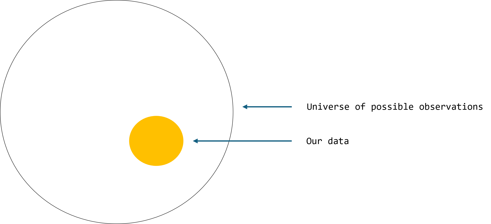
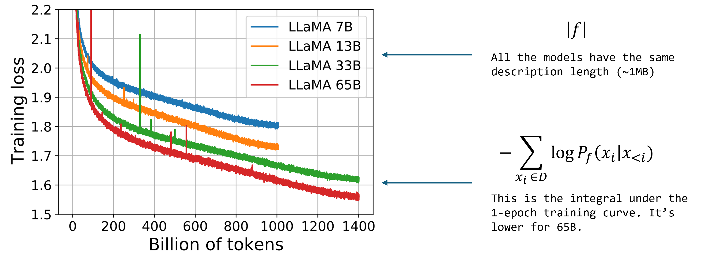

# Compression for AGI

**Source:** [Episode 76 of the Stanford MLSys Seminar 'Foundation Models Limited Series'](https://www.youtube.com/watch?v=dO4TPJkeaaU)

## Takeaways

- Seek the minimum description length to solve perception

- Generative models are lossless compressors

- LLMs are SoTA lossless text compressors (!?)

- What are the current limitations?

## Minimum Description Length

... and why it relates to perception

We want the deepest understanding of our observations.

Ones that generalize.

**Aristotle's Posterior Analytics (4th century BC):** "we may assume the superiority of the demonstration which derives from fewer postulates or hypotheses."

**Occam's Razor (14th century):** "The simplest of several competing explanation is always the likeliest to be the correct one."

**Solomonoff's Theory of Inductive Inference (1964):** "If the Universe is generated by an algorithm, then observations of that Universe, encoded as a dataset, are best predicted by the smallest executable archive of that dataset."

Think about Searle's Chinese room thought experiment.

If a computer program translates en <--> zh via a series of rules, does it understand translation?

If the computer uses a lookup of direct translations of all possible phrases, it has the **least** understanding of translation.

If the computer can operate on a smaller set of instructions, it will generalise better.

Generalization, and arguably understanding, increase as the translation description length shrinks towards the MDL.

We can compress a dataset $D$ using a generative model $f$

$|D| = -\log{P_f(D)} + |f|$

$|D|$ - lossless compression of $D$

$-\log{P_f(D)}$ - negative log likelihood from a generative model $f$ over $D$

$|f|$ - description length of function approximator e.g. for a neural network, compressed size of code 
to initialize **NOT** influenced by the size of the neural network

Compression is an objective we can't cheat

**Example:** contaminated pre-training
- what if we pre-train $f$ on $D$ with perfect memorization i.e. such that $\log{P_f(D)} = 0$
- in this setting, the description of $f$ includes $D$, so $|f| \geq |D|$ => no improvement
- this contrasts with regular test-set benchmarking, where we can unintentionally train on the test-set

## Lossless Compression with LLMs

Compressing $D$ amounts to better next-token prediction from an LLM ($f$)

$|D| = -\log{P_f(D)} + |f| = -\sum_{x_i \in D}\log{P_f(x_i|x_{<i})} + |f|$

$\sum_{x_i \in D}\log{P_f(x_i|x_{<i})}$ - sum of next-token prediction training loss

$|f|$ - code to instantiate and train a transformer: ~100KB (Note: this doesn't depend on how large the model is)

**Compression Stats**
- original dataset: 5.6TB raw text
- compressed: 1MB for code + 397.3GB for model
- compression rate: ~14x
- best text compressor on Hutter prize: 8.7x

## But how does it work?

Let's put this together...

Alice wants to send a dataset of the world's knowledge $D$ to Bob.

Bob has access to supercomputers, but there's a low bandwidth connection.

We can make use of [arithmetic coding](https://en.wikipedia.org/wiki/Arithmetic_coding).

We have a token $x_t$ at timestep $t$ from vocab $V$ and a probability distribution $p_t$ over tokens.

1. $\texttt{arithmetic\_encode}(x_t | p_t) \rightarrow z_t$ where $z_t$ takes up $-\log{p_t(x_t)}$ bits

2. $\texttt{arithmetic\_decode}(z_t | p_t) \rightarrow x_t$ which still needs $p_t$ to decode

**Example 1:** if $p_t$ is uniform i.e. $1/|V|$, this uses $\log{|V|}$ space. Same as naive storage!

**Example 2:** if $p_t$ is an oracle i.e. $p_t(x_t) = 1$, this uses zero space

Alice has the code to instantiate and deterministically train an LLM, it's ~1MB.

He trains an LLM over the dataset and records next-token probabilities.

Then he encodes this with arithmetic encoding.

Alice sends the code and the arithmetic encoded transcript.

**Total bits:** training code [~1MB] + encoded transcript [$-\sum\log{p_t(x_t)}$ bits]

Bob runs the deterministic training code:
- it initializes the same initial network, at time step 1 the model emits $p_1$
- using arithmetic decoding: $\texttt{arithmetic\_decode}(z_1 | p_1) \rightarrow x_1$
- take a training step, network predicts $p_1$ and repeat...
- until $D$ is fully decoded

**Fun fact:** language models were proposed by Shannon in 1948 with this setup in mind - communicating data over a low-bandwidth channel

**A recipe for perception:**
1. collect all useful perceptual information
2. learn to compress it as best as possible with a powerful foundation model

You can use any research method to improve compression:
- better architecture
- scale
- tool use
- retrieval over the past
- synthetic data

**Lossy compression!?**
- Ted Chiang's ChatGPT is a blurry JPEG of the Internet
- there is a lot of confusion over compression with neural networks
- the weights of a neural network can be seen as a lossy compression of the source data
- however, it's a terrible lossy compression (huge param size and loses lots of info)
- we don't train a neural network to simply recover the training set
- we train them to best losslessly compress the training set, because this gives us the best generalization
- we care about generalization!

## Limitations

Compressing everything may be correct but inefficient:
- e.g. pixel-level image modelling is expensive
- pixel-level video modelling seems positively crazy

Lots of useful information in the world that is **not** observable:
- why on-policy behavior is still incredibly important
- e.g. projects such as AlphaZero, Cicero, &c.

## Conclusions

The most known entity to better compression is scale.

But scale isn't all you need...

There are likely many algorithmic advances out there waiting to be found.

Almost all major LM modelling advances are synonymous to far greater text compression:
- pen-and-paper n-gram language models
- digitized n-gram models
- longer-context RNN deep learning models
- large-scale transformers
- **what's next?**